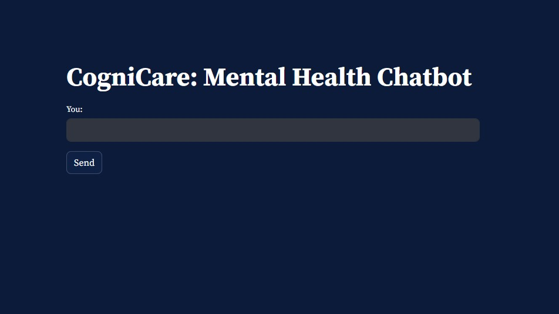

# CogniCare: Mental Health Chatbot

CogniCare is a mental health chatbot designed to provide support and assistance to users dealing with various mental health concerns. The chatbot utilizes Natural Language Processing (NLP) and Machine Learning (ML) techniques to engage in conversations, offer support, and provide relevant resources.

## Key Features

- **Conversational Interface**: Users can interact with the chatbot through a simple text-based interface, allowing for natural conversations and discussions.

- **Personalized Support**: CogniCare offers personalized support tailored to each user's needs and concerns. Through intelligent algorithms, the chatbot adapts its responses to provide relevant and empathetic support.

- **Resource Recommendations**: The chatbot provides users with helpful resources such as articles, videos, and self-help tips related to mental health and well-being.

- **Privacy and Confidentiality**: CogniCare prioritizes user privacy and confidentiality, ensuring that all interactions are secure and anonymous.

## Architecture

## Getting Started

To use CogniCare, follow these steps:

1. **Launch the Application**: Open the CogniCare web application or integrate it into your existing platform.

2. **Engage in Conversation**: Start a conversation with the chatbot by typing your messages into the text input field.

3. **Receive Support**: Receive personalized support, guidance, and resources from the chatbot based on your input and needs.

4. **Explore Resources**: Explore the recommended resources provided by the chatbot to learn more about mental health and well-being.

## Technologies Used

- **Python**: Backend development and machine learning models.
- **TensorFlow/Keras**: Deep learning framework for building and training the chatbot model.
- **Streamlit**: Frontend development and web application deployment.
- **JSON**: Data storage and retrieval for intents and responses.
- **Pandas/Numpy**: Data manipulation and preprocessing.

## Screenshots

## Feedback and Support

For feedback, suggestions, or support inquiries, please contact [subhangi.sati270@gmail.com]

